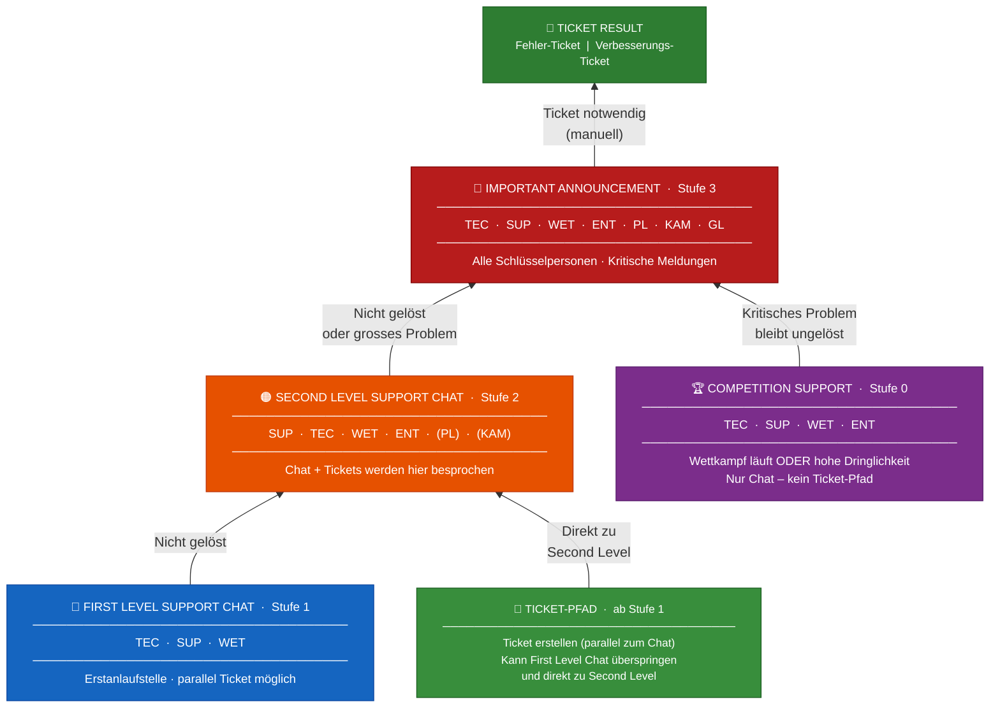
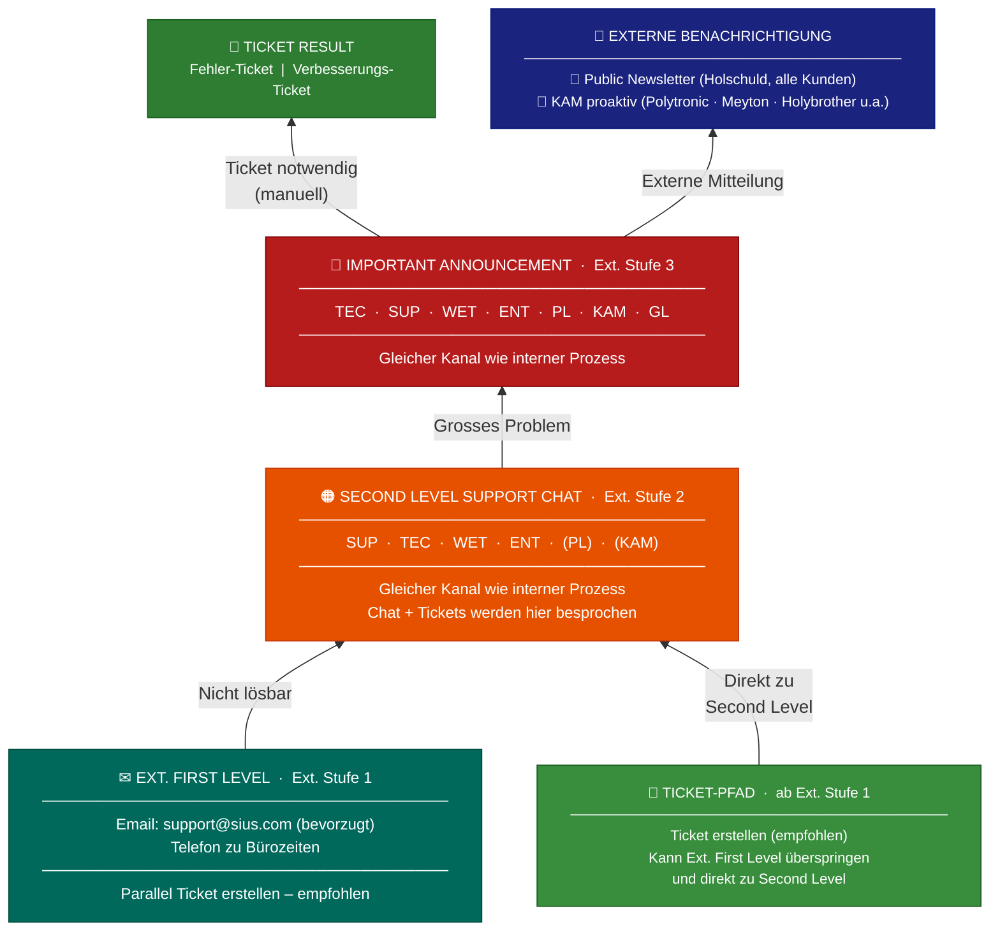

# Support-Prozess – Eskalationsübersicht

**SIUS | Interner & Externer Support-Prozess**  
Je höher die Stufe, desto höher die Eskalation.

---

## Interner Prozess



---

## Externer Prozess



---

## Legende

| Farbe | Stufe | Kanal / Pfad |
|-------|-------|-------|
| 🟣 Lila | Stufe 0 | Competition Support – nur Chat |
| 🔵 Blau | Stufe 1 | First Level Support Chat (intern) |
| 🟢 Dunkelgrün | Ext. Stufe 1 | Ext. First Level – Email / Telefon (extern) |
| 🟩 Grün (heller) | ab Stufe 1 | **Ticket-Pfad** – parallel zum Chat, kann First Level überspringen |
| 🟠 Orange | Stufe 2 | Second Level Support Chat (intern & extern – Chat + Tickets) |
| 🔴 Rot | Stufe 3 | Important Announcement (intern & extern geteilt) |
| 🔷 Dunkelblau | – | Externe Benachrichtigung (Newsletter / KAM) |
| 🟢 Dunkelgrün | – | Ticket-Ergebnis (Massnahme nach Important Announcement) |

---

## Schnellübersicht: Chat-Pfad & Ticket-Pfad im Vergleich

```
▲  höchste Eskalation
│
│  ┌──────────────────────────────────────────────────────────────────┐
│  │  🔴  IMPORTANT ANNOUNCEMENT  (Stufe 3 – intern & extern)        │
│  │  TEC · SUP · WET · ENT · PL · KAM · GL                          │
│  │  ──────────────────────────────────────────────────────────────  │
│  │  Intern: Kanal-Meldung    │  Extern: Newsletter + KAM proaktiv  │
│  └──────────────────────────────────────────────────────────────────┘
│            ▲                              ▲
│            │ nicht gelöst /               │ nicht gelöst /
│            │ grosses Problem              │ grosses Problem
│  ┌──────────────────────────────────────────────────────────────────┐
│  │  🟠  SECOND LEVEL SUPPORT CHAT  (Stufe 2 – intern & extern)     │
│  │  SUP · TEC · WET · ENT · (PL) · (KAM)                           │
│  │  Chat + Tickets werden hier besprochen                           │
│  └──────────────────────────────────────────────────────────────────┘
│       ▲               ▲                    ▲              ▲
│       │ Chat nicht    │ 🎫 Ticket direkt   │ Chat nicht   │ 🎫 Ticket direkt
│       │ gelöst        │ zu 2nd Level       │ gelöst       │ zu 2nd Level
│  ┌────────────┐  ┌───────────────────┐  ┌──────────────────────────────┐
│  │ 🔵 1ST     │  │ 🎫 TICKET-PFAD   │  │  ✉  EXT. FIRST LEVEL         │
│  │ LEVEL CHAT │  │ ab First Level    │  │  Email: support@sius.com     │
│  │ TEC·SUP·WET│  │ parallel zum Chat │  │  Telefon zu Bürozeiten       │
│  └────────────┘  │ kann FL überspri. │  │  🎫 Ticket parallel möglich  │
│       ▲          └───────────────────┘  └──────────────────────────────┘
│       │                  ▲                           ▲
│  ┌────────────┐          │                           │
│  │ 🏆 COMP.  │     Interne Anfrage           Externe Anfrage
│  │ SUPPORT   │     (Chat oder Ticket)         (Chat oder Ticket)
│  │TEC·SUP·   │
│  │WET·ENT    │
│  │ Nur Chat! │
│  └────────────┘
│
▼  niedrigste Eskalation
```
