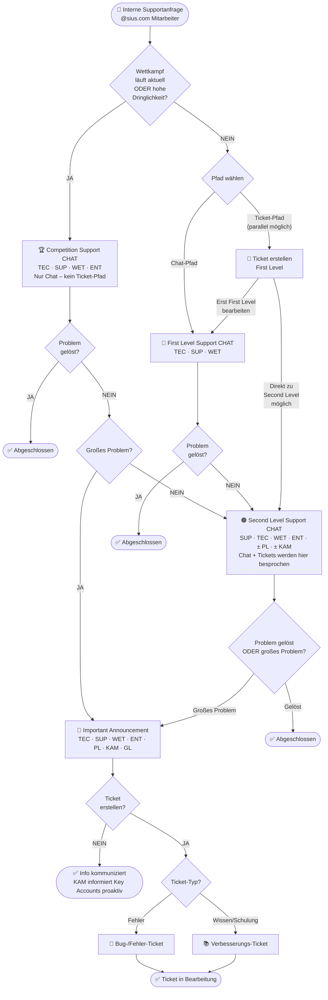
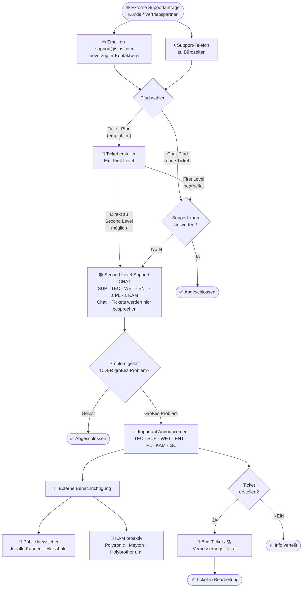

# Support-Prozess – Flussdiagramm

**SIUS | Interner & Externer Support-Prozess**  
Gültig für: Alle internen Mitarbeiter (@sius.com) sowie externe Kunden und Vertriebspartner

---

## Interner Prozess

Zwei parallele Pfade: **Chat-Pfad** (blau/orange) und **Ticket-Pfad** (grün). Beide konvergieren im Second Level Support Chat.

---

## Externer Prozess

Zwei parallele Pfade: **Chat/Email-Pfad** und **Ticket-Pfad**. Beide konvergieren im Second Level Support Chat.

---

## Legende

| Symbol | Bedeutung |
|--------|-----------|
| 🏆 | Competition Support – sofortige Eskalation bei Wettkampf |
| 🔵 | First Level Support – Erstanlaufstelle intern |
| ✉ / 📞 | Ext. First Level – Email (bevorzugt) oder Telefon zu Bürozeiten |
| 🟠 | Second Level Support – geteilt zwischen intern & extern |
| 🔴 | Important Announcement – höchste interne Eskalationsstufe |
| 📰 | Public Newsletter – externe Benachrichtigung (Holschuld) |
| 🤝 | KAM proaktiv – Benachrichtigung für Key Accounts |
| ✅ | Prozess abgeschlossen |
| 🐛 | Fehler-Ticket |
| 📚 | Verbesserungs-/Schulungsticket |
| 🎫 | Ticket-Pfad – parallel zum Chat, ab First Level möglich, direkt zu Second Level eskalierbar |

---

## Rollen-Kürzel

| Kürzel | Rolle |
|--------|-------|
| TEC | Techniker |
| SUP | Support |
| WET | Wettkampf |
| ENT | Entwickler |
| PL | Projektleiter |
| KAM | Key Account Manager |
| GL | Geschäftsleitung |
